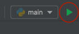

# Snake-Pygame
This is a basic version of snake game. As it moves forward, it leaves a trail behind, resembling a moving snake.
The player loses when the snake runs into the screen border (there are four walls around the screen) or itself. Snake has 5 lives. 
A sole player attempts to eat apples by running into them. Each apple eaten makes the snake longer and adds points. Big apples give more points.

As you run a program first the popup window shows up asking to enter the name of the player. 
By the end of the game the results (player's name, apples amount, points) are written to the .txt file. 

The control keys are:
- "up"
- "down"
- "left"
- "right".

Double press makes the snake to speed up.

Used libraries:
- pygame
- kivy


## Setup

Pre-requirements:

* python 3.9 >
* virtualenv

Install virtualenv 

```shell
pip install virtualenv
```

On Windows OS you need to add virtualenv installation path into
PATH environment variable of the system.
[Example tutorial on that](https://linuxhint.com/activate-virtualenv-windows/)


## Virtual Environment

### If you would like to use **virtualenv**
Create virtual environment.
From the root directory run.

```shell
virtualenv snakegameenv
```

where "snakegameenv" is the custom name of the environment

Activate the environment

On Windows you need this command:

```shell
<environment name>\Scripts\activate
```

in our case:

```shell
snakegameenv\Scripts\activate
```

On Unix system

```shell
source snakegameenv/bin/activate
```

**Install requirements**

```shell
pip install -r requirements.txt
```

### Instead of virtualenv you can use **conda**

Create and activate environment:

```shell
conda create --name Snake-Pygame  python=3.10
conda activate Snake-Pygame
```

Install packages:

```shell
conda install --file requirements.txt
```

### Before commit 

Save all installed packages to the list of requirements:

With pip
```shell
pip freeze > requirements.txt
```

With conda

```shell
conda list --export > requirements.txt
```


## Run the app

In the terminal run

```shell
python ./src/main.py
```

In PyCharm with Run button in the top menu

